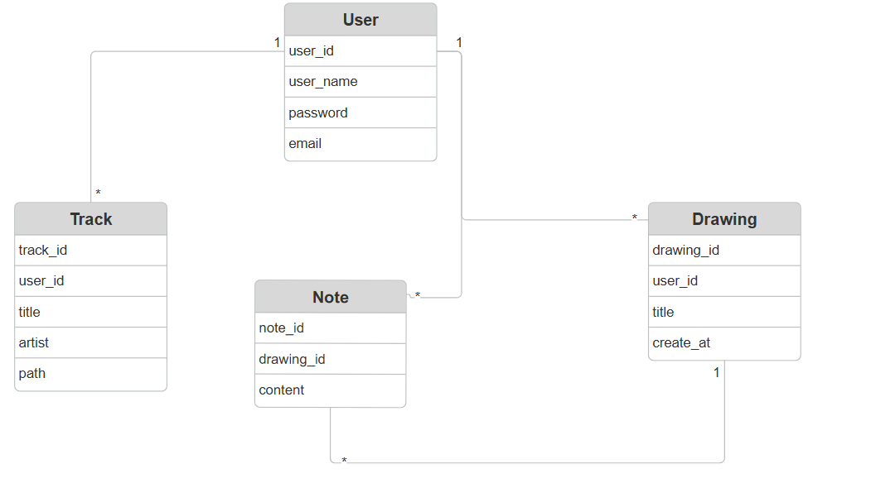

# Artchill
## Descriptions
Artchill it's a website to draw on a canvas using brush and pen with a color pallet and eraser.
you can also type some notes for your drawing, and the best part you can listening to your favorite music via youtube or you can uploading your own music !

## Tech stack
- Django
- Rest_framework
- Python 
- pipenv 
- Corsheaders

## Repo Link
[backend repo](https://git.generalassemb.ly/aishabajandouh/Artchill_backend)

## Installation Instructions
in your powershell or CLI 
1. `git clone my_repo_link `
2. `cd Artchill_backend`
3. `code .`
4. in vs code termenal: 
- Windows: `python manage.py runserver` 
- Mac: `python3 manage.py runserver`

## ERD 

## IceBox Features
- let user update his saving drawings 
- delete Note module and add it to the canvas module 
- saved the track that user upload to the website 
- user authentication 

